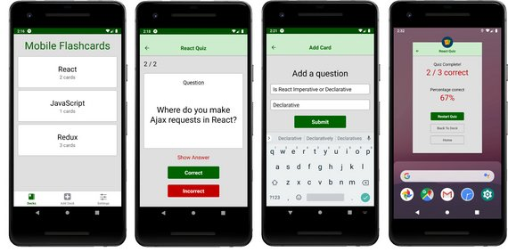

[](https://travis-ci.org/joemccann/dillinger)

# Mobile Flashcards
Mobile Flashcards is a React Native app for iOS and Android that allows users to create decks, add cards and quiz themselves.



It uses React Native, Expo, Redux, & React Navigation.

This app is the third of three projects required for [Udacity's React Nanodegree program](https://www.udacity.com/course/react-nanodegree--nd019).

- Code Notes: Step-by-step walk-though of how this project was built

### Installation
Clone the repository, change directories, and use npm or yarn to install the dependencies.
```sh
$ git clone https://github.com/james-priest/mobile-flashcards.git
$ cd mobile-flashcards
$ yarn
```
### Usage
The project can be run with npm or yarn
``` - yarn start ```

This will open Expo Developer Tools in the browser. You can then do one of the following.
 - Use your device to test:
    - Scan the QR Code using the Expo Client app (Expo Client for Android & iOS) from an Android or iOS device.

 - Use an Android Emulator or iOS Simulator to run the app:
    - iOS Simulator Setup
    - Android Emulator Setup

### Testing
This project has been tested on the following platforms:

- iOS 11+
- Android 9+.

###### Copyright Saba722
